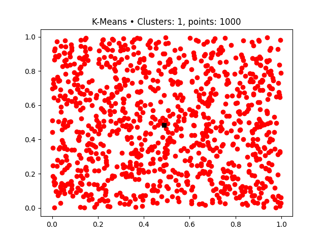
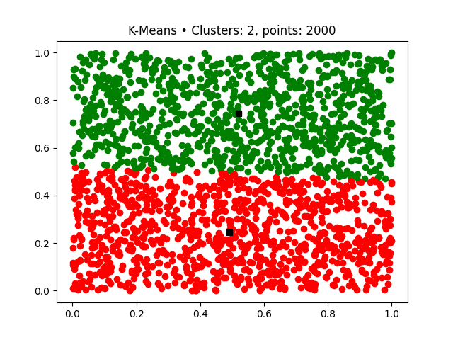
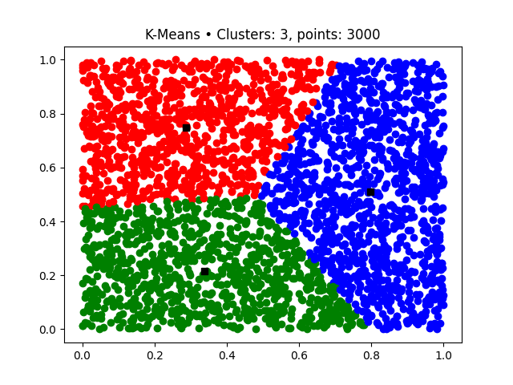
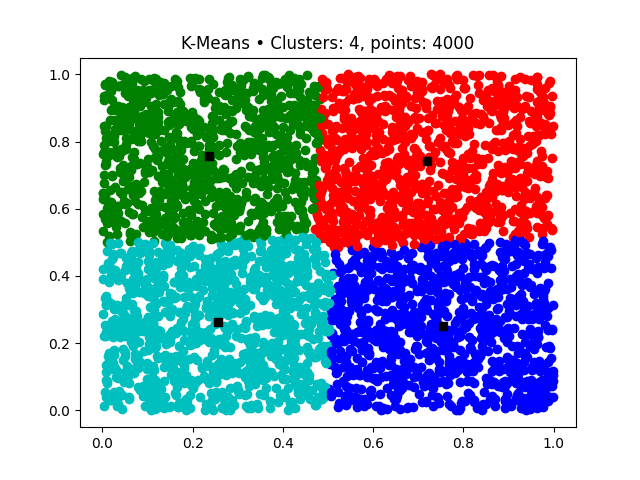
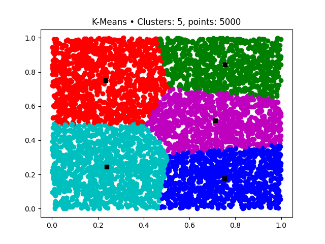
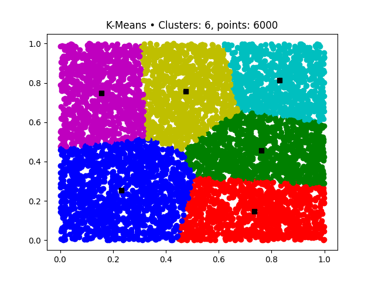
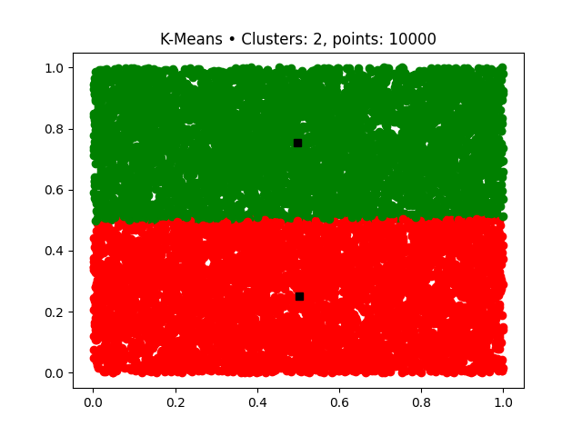
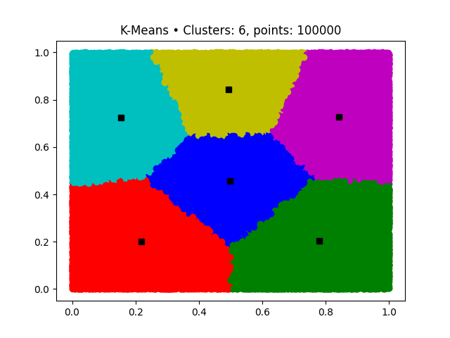

# Basic K-Means

## Purpose
A project created for fun and improving skills.

## Dependencies
In [requirements.txt](https://github.com/Yrazec/K-Means/blob/main/requirements.txt) you can find list of dependencies that will be necessary to run the project.

## Important
- The project is a standalone application that can be run from the CLI.
- The project is a short, warm-up implementation, no magic happens here, and no ML/AI/DL functionalities are used.

## Structure
Project contains 3 important files:
- [runner.py](https://github.com/Yrazec/K-Means/blob/main/runner.py) - Runner file for K-Means wrapped in GUI.
- [/gui/gui.py](https://github.com/Yrazec/K-Means/blob/main/gui/gui.py) - File for storing Graphical User Interface feature.
- [/libs/k_means.py](https://github.com/Yrazec/K-Means/blob/main/libs/k_means.py) - File for storing K-Means feature.

## Content
The project implements the K-Means algorithm in several hundred lines of code. The K-Means algorithm clusterize selected points into possibly equal clusters with relative nearest centers. Both the number of centers and the number of entry points are parameters.

## Examples

#  
###### Cezary Pietruszyński ∙ [LinkedIn](https://www.linkedin.com/in/cezary-pietruszynski-tkd/)
_Yrazec is just Cezary but reversed!_
